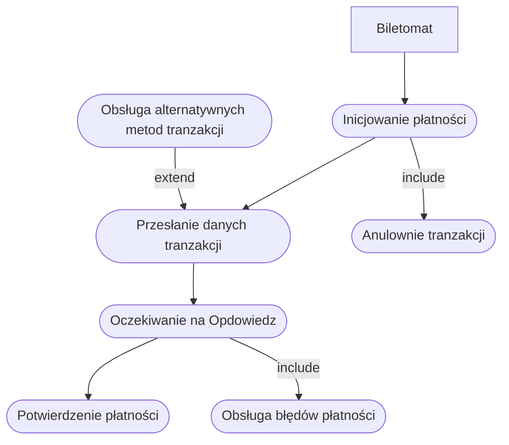

# Historyjki

- **Jako biletomat**, chcę automatycznie aktualizować listę dostępnych biletów i ich cen, aby zapewnić zgodność z polityką przewoźnika.
- **Jako biletomat**, chcę rejestrować wszystkie transakcje i wysyłać raporty do systemu centralnego, aby umożliwić monitoring i kontrolę operacji.
- **Jako biletomat**, chcę posiadać czytelny ekran dotykowy, aby użytkownik mógł
łatwo nawigować po interfejsie.
- **Jako biletomat**, chcę być wyposażony w różne metody płatności (terminal kart,
czytnik gotówki, NFC), aby obsługiwać różnorodne transakcje.
- **Jako biletomat**, chcę wydawać resztę w gotówce, jeśli użytkownik zapłaci
nadmiarowo, aby transakcja była zgodna z oczekiwaniami.


# Przypadki użycia


## DIAGRAMY PRZYPADKÓW UŻYCIA
### REALIZACJA PŁATNOŚCI


## Wspólny diagram przypadków użycia
```mermaid
flowchart TD
    Biletomat["Biletomat"] --> InicjowaniePłatności(["Inicjowanie płatności"]) & WyswietlenieBiletow(["Wyświetlenie dostępnych biletów"])
    InicjowaniePłatności --> PrzesłanieDanychTransakcji(["Przesłanie danych transakcji"])
    PrzesłanieDanychTransakcji --> OczekiwanieNaOdpowiedz(["Oczekiwanie na odpowiedź"])
    OczekiwanieNaOdpowiedz --> Potwierdzenie(["Potwierdzenie płatności"])
    OczekiwanieNaOdpowiedz -- include --> ObslugaBledowPlatnosci(["Obsługa błędów płatności"])
    InicjowaniePłatności -- include --> Anulowanie(["Anulowanie transakcji"])
    ObslugaAlternatywnychMetodTransakcji(["Obsługa alternatywnych metod transakcji"]) -- extend --> PrzesłanieDanychTransakcji
    WyswietlenieBiletow --> PobranieListyBiletow(["Pobranie listy biletów"])
    PobranieListyBiletow --> WyświetlenieBiletów(["Wyświetlenie biletów"])
    WyświetlenieBiletów --> OczekiwanieNaWybor(["Oczekiwanie na wybór użytkownika"])
    OczekiwanieNaWybor -- include --> PobranieDostepnychBiletow(["Pobranie listy dostępnych biletów"])
    OczekiwanieNaWybor -- expend --> Ostrzeżenie(["Ostrzeżenie o braku danych"])
