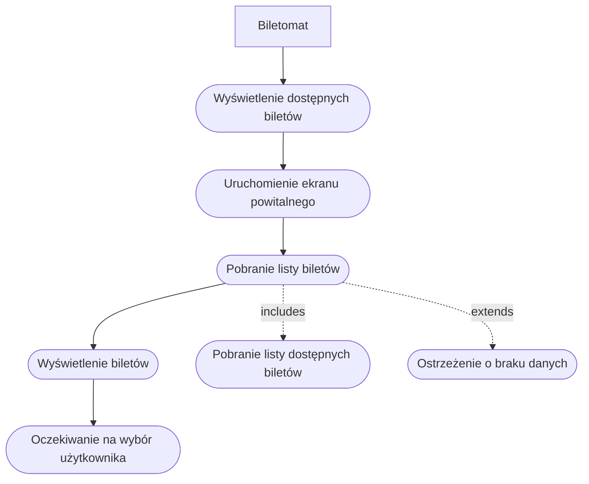
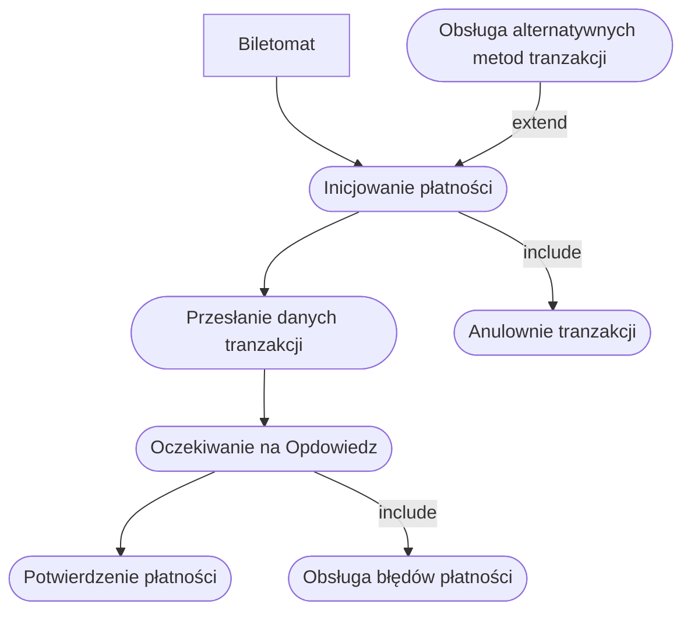
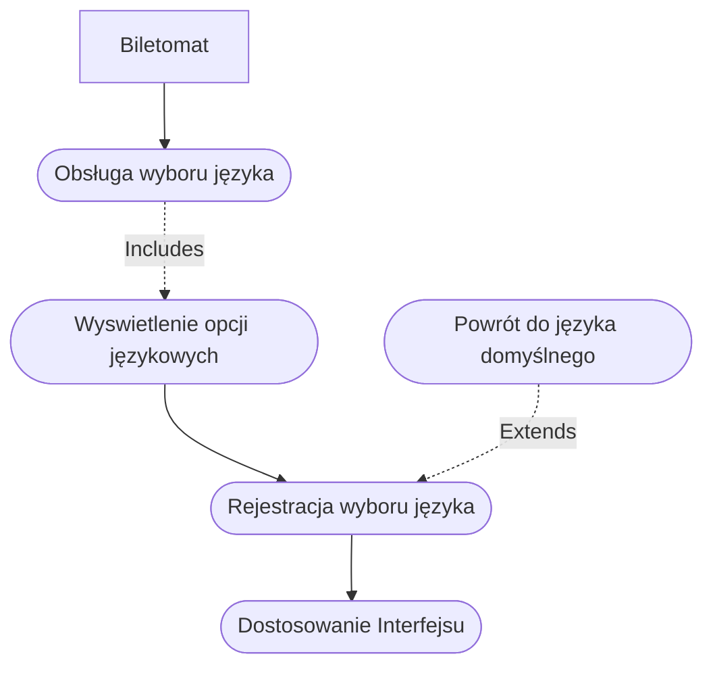
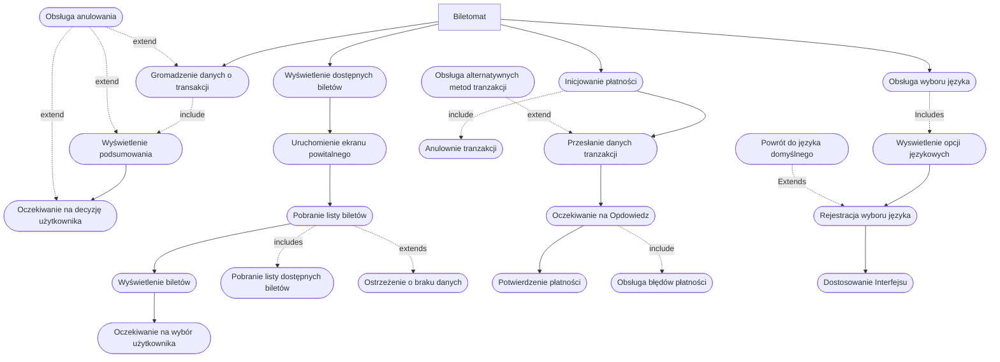
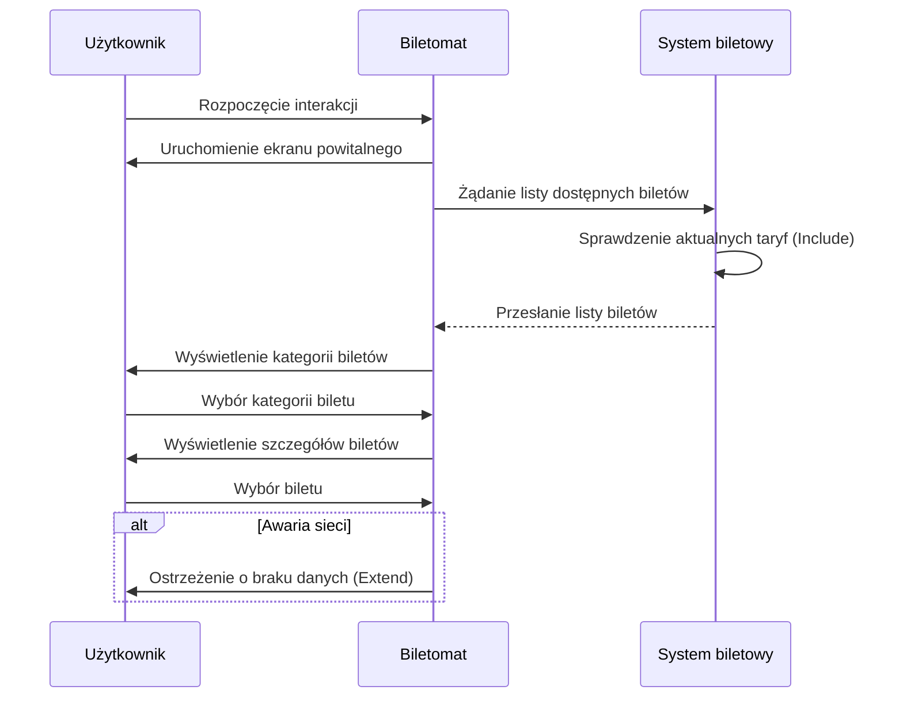
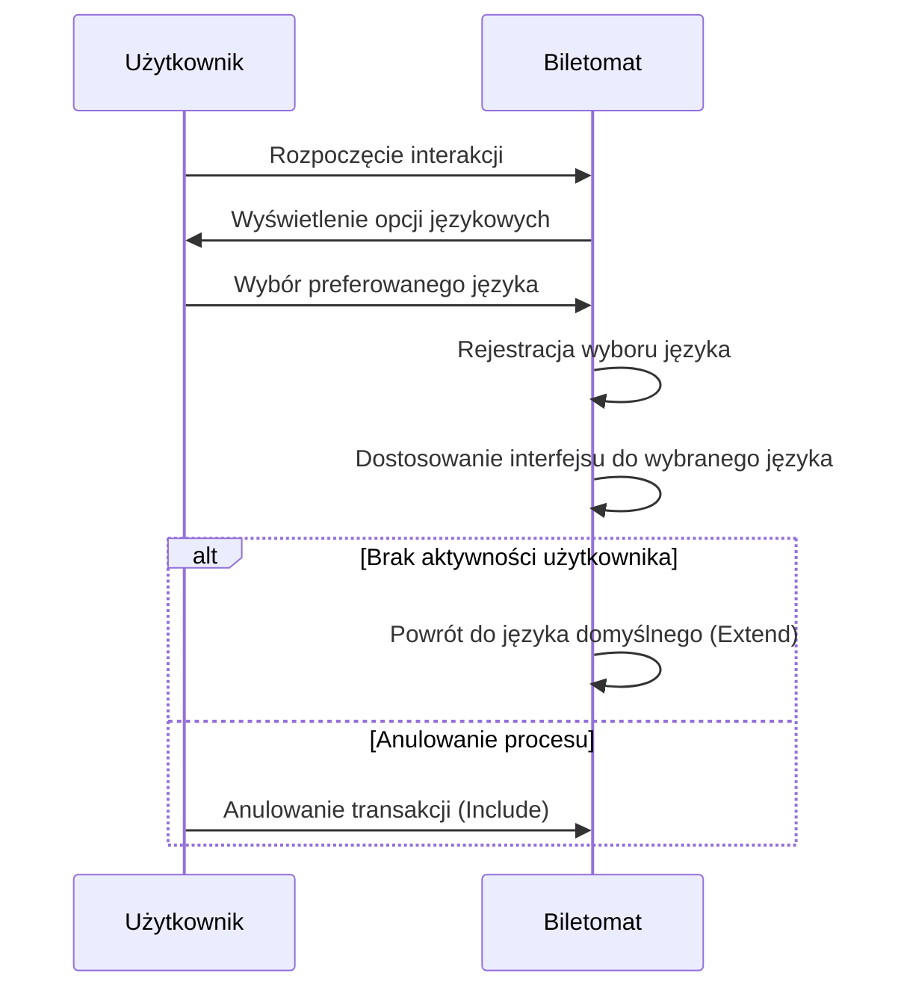

# Historyjki

- **Jako biletomat**, chcę automatycznie aktualizować listę dostępnych biletów i ich cen, aby zapewnić zgodność z polityką przewoźnika.
- **Jako biletomat**, chcę rejestrować wszystkie transakcje i wysyłać raporty do systemu centralnego, aby umożliwić monitoring i kontrolę operacji.
- **Jako biletomat**, chcę posiadać czytelny ekran dotykowy, aby użytkownik mógł
łatwo nawigować po interfejsie.
- **Jako biletomat**, chcę być wyposażony w różne metody płatności (terminal kart,
czytnik gotówki, NFC), aby obsługiwać różnorodne transakcje.
- **Jako biletomat**, chcę wydawać resztę w gotówce, jeśli użytkownik zapłaci
nadmiarowo, aby transakcja była zgodna z oczekiwaniami.


## DIAGRAMY PRZYPADKÓW UŻYCIA
### WYŚWIETLENIE DOSTĘPNYCH BILETÓW


### REALIZACJA PŁATNOŚCI


### OBSŁUGA WYBORU JĘZYKA

### WYŚWIETLENIE PODSUMOWANIA TRANZAKCJI
```
flowchart TD
    Gromadzeniedanychotransakcj(["Gromadzenie danych o transakcji"]) -. include .-> WyświetleniePodsumowania(["Wyświetlenie podsumowania"])
    WyświetleniePodsumowania --> OczekiwanienaDecyzję(["Oczekiwanie na decyzję użytkownika"])
    Biletomat["Biletomat"] -->  Gromadzeniedanychotransakcj(["Gromadzenie danych o transakcji"])
    Obsługaanulowania(["Obsługa anulowania"]) -. extend .->Gromadzeniedanychotransakcj & WyświetleniePodsumowania & OczekiwanienaDecyzję
```
## Wspólny diagram przypadków użycia


### Diagram sekwencji WYŚWIETLENIE DOSTĘPNYCH BILETÓW

### Diagram sekwencji OBSŁUGA WYBORU JĘZYKA
