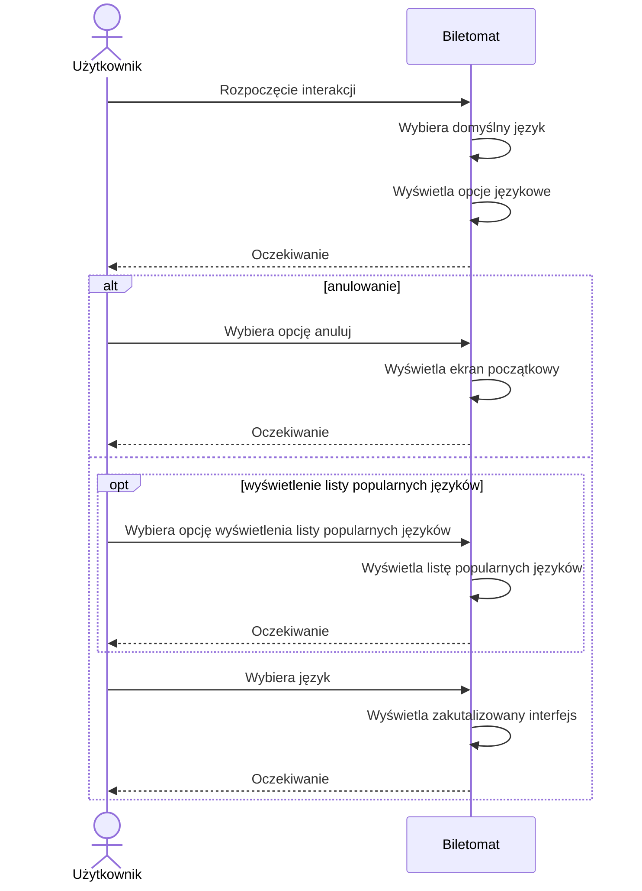
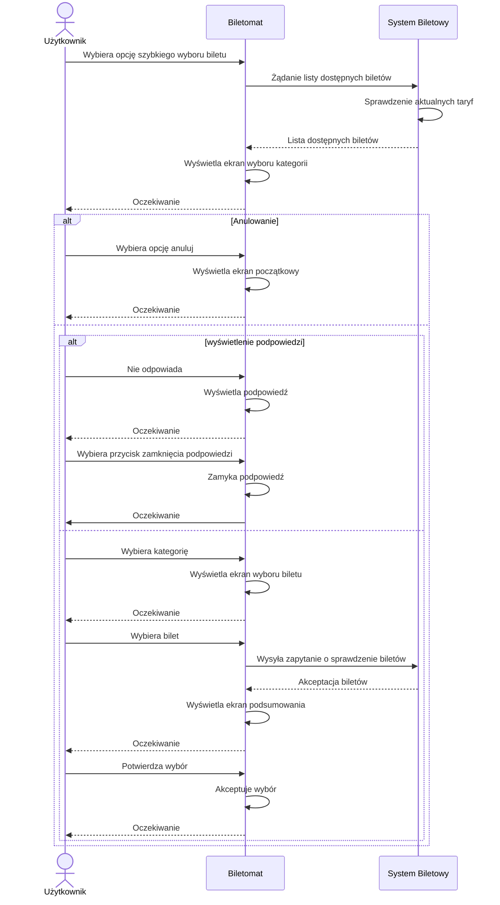
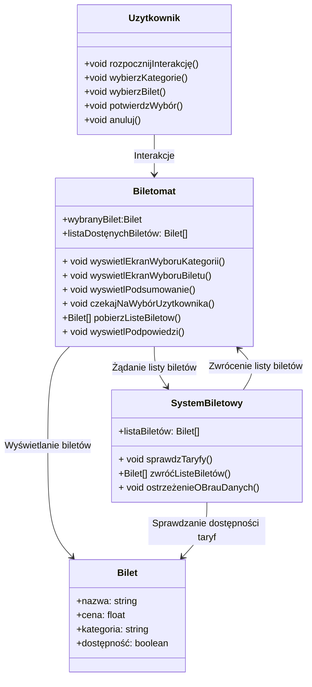
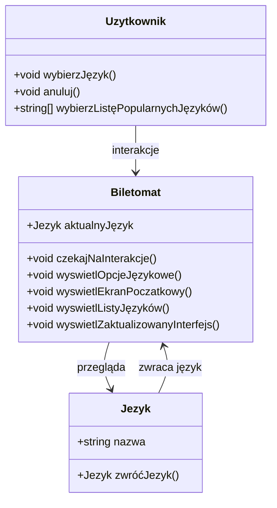

- **Jako użytkownik**, chcę szybko wybierać rodzaj biletu, aby zminimalizować czas spędzony przy biletomacie.
- **Jako użytkownik**, chcę mieć możliwość wyboru języka, aby móc korzystać z biletomatu bez względu na znajomość języka lokalnego.
- **Jako użytkownik**, chcę sprawdzić poprawnośc transakcji przed jej finalizacją, aby uniknać pomyłek.
- **Jako użytkownik**, chcę otrzymać potwierdzenie zakupu (np. wydruk biletu lub elektroniczny bilet), aby móc korzystać z transportu zgodnie z przepisami.
- **Jako użytkownik**, chcę płacić za bilet kartą, gotówką lub telefonem, aby mieć
większą elastyczność w wyborze metody płatności.
- **Jako użytkownik**, chcę otrzymać wyraźne instrukcje na ekranie, aby wiedzieć,
jak dokonać zakupu krok po kroku.
- **Jako użytkownik**, chcę widzieć czas pozostały na decyzję (np. wyświetlany
licznik czasu), aby móc szybko podjąć działanie.

## DIAGRAMY PRZYPADKÓW UŻYCIA

### SZYBKI WYBÓR RODZAJU BILETU

### WYBÓR JĘZTKA

### PŁATNOŚĆ ZA BILET

### SPRAWDZENIE POPRAWNOŚCI TRANZAKCJI

### WSPÓLNY DIAGRAM

### Diagram sekwencji WYBÓR JĘZYKA

### Diagram sekwencji SZYBKI WYBÓR RODZAJU BILETU

### Diagram klas SZYBKI WYBÓR RODZAJU BILETU

 
### Diagram klas dla WYBÓR JĘZYKA

